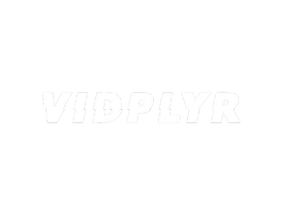

  

### An Android RTSP Player that plays video from a hardcoded url

## Core technologies
#### 1. Vlclib for audio and video playback
#### 2. Compose for UI
#### 3. Dagger Hilt for dependency injection and state management with View Model
## Capabilities
#### 1. Audio and video playback from the RTSP URL
#### 2. Fullscreen functionality
#### 3. Play/Pause functionality
#### 4. Easy volume control through a slider
## Additionally
##### Themed app icon and usage of Material 3's dynamic theme colors
## Usage
##### Just go to [Releases](https://github.com/Lyubo33/VidPlayer/releases) and download the latest apk

